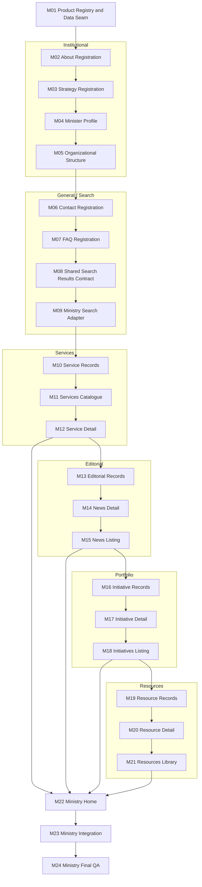

# Ministry Website V1 Build Plan

Status: sequenced implementation plan. M01–M04 are complete; M05–M24 remain planned. Package IDs M01–M24 are stable execution identifiers. About, Strategy, and Minister Profile are the only Ministry page definitions/demo records; Minister Profile is the only Ministry template; no Search code or Foundation changes have started.

## 1. Executive Build Strategy

Build Ministry V1 through 24 bounded work packages. Each package owns one data seam, page contract, renderer, family listing/detail step, integration gate or QA concern. Record contracts always precede their renderers; detail renderers precede listings; Home consumes completed Services, Editorial, Portfolio and Resources; product-wide integration and broad QA remain separate.

The sequence preserves the legacy no-argument and `--config` builds alongside `--product ministry`. It extends the current builder only through registered product renderer IDs and validated data references. Product templates stay under `products/ministry/`; shared Search/Results is the only planned new shared capability. No package copies Foundation files into the product.

Normal packages run focused unit/static/build checks. The broad browser matrix, responsive and RTL review, keyboard/accessibility review, visual comparison and complete package audit run once in M24.

## 2. Dependency Graph

M09 establishes an adapter that derives its index from registered content. M23 verifies that later Services, Editorial, Portfolio and Resource records enter that index without hand-maintained duplication.

## 3. Work Package Summary

| ID | Name | Classification | Complexity | Direct dependency | Primary result |
|---|---|---|---|---|---|
| M01 | Product Registry and Data Seam | Infrastructure | MEDIUM | Product Boundary | Ministry pages/content can be loaded by registered IDs without breaking legacy builds |
| M02 | About Ministry Registration | REUSE | LOW | M01 | `about.html` from product definition and demo record |
| M03 | Strategy Registration | REUSE | LOW | M02 | `strategy.html` through Heavy Content |
| M04 | Minister Profile | NEW | MEDIUM | M03 | Ministry-owned Minister contract and page |
| M05 | Organizational Structure | NEW | HIGH | M04 | Accessible Ministry hierarchy page |
| M06 | Contact Registration | REUSE | LOW | M05 | Existing Contact capability from Ministry data |
| M07 | FAQ Registration | REUSE | LOW | M06 | Existing FAQ capability from Ministry questions |
| M08 | Shared Search Results Contract | NEW | HIGH | M07 | Generic shared results UI/contract, no product index |
| M09 | Ministry Search Adapter and Route | Integration | MEDIUM | M08 | Static Ministry index adapter and `search.html` registration |
| M10 | Ministry Service and Category Records | Infrastructure | LOW | M09 | Validated product-owned service collection |
| M11 | Services Catalogue Registration | REUSE | LOW | M10 | Existing catalogue registered as `services.html` |
| M12 | Service Detail Registration | REUSE | LOW | M11 | Existing detail renderer generates canonical service routes |
| M13 | Editorial Record Contract | Infrastructure | MEDIUM | M12 | Validated News records shared by detail/listing |
| M14 | News Detail | ADAPT | MEDIUM | M13 | Product-owned Editorial detail around Heavy Content |
| M15 | News Listing | NEW | MEDIUM | M14 | Product-owned Editorial listing configured for News |
| M16 | Initiative Record Contract | Infrastructure | MEDIUM | M15 | Validated Initiative records and status vocabulary |
| M17 | Initiative Detail | ADAPT | MEDIUM | M16 | Product-owned Portfolio detail around Heavy Content |
| M18 | Initiatives Listing | NEW | MEDIUM | M17 | Product-owned Portfolio listing configured for Initiatives |
| M19 | Resource Record and Download Safety | Infrastructure | MEDIUM | M18 | Validated resource kinds and safe file/URL metadata |
| M20 | Resource Detail / Download | ADAPT | MEDIUM | M19 | Product-owned Resource detail around Heavy Content |
| M21 | Resources Library | NEW | HIGH | M20 | Filterable product-owned library with accessible downloads |
| M22 | Ministry Home Composition | ADAPT | MEDIUM | M12, M15, M18, M21 | Ministry Home composed from stable records/routes |
| M23 | Ministry Integration | Integration | HIGH | M02–M22 | Complete registry/navigation/cross-link/package integration |
| M24 | Ministry Final QA | QA | HIGH | M23 | Product-wide release evidence and completion decision |

## 4. Product Registry/Data Packages

### M01 — Product Registry and Data Seam

- **Status:** COMPLETE.
- **Goal:** Make `products/ministry/pages/` and `products/ministry/content/demo/` authoritative inputs while preserving every current build entry point.
- **Classification:** Infrastructure.
- **Exact scope:** Define `pages/index.json` registration shape, content-reference rules and an allow-listed renderer registry; load product page/content files through `product.json`; retain the transitional source only for unmigrated concerns; reject unknown renderer IDs, duplicate routes, missing references and path escapes.
- **Expected files/directories affected:** `scripts/build_site.py`; `products/ministry/product.json`; `products/ministry/pages/index.json`; `products/ministry/content/demo/index.json` if a content registry is required; focused product-boundary/build tests; concise product architecture documentation.
- **Foundation assets reused:** Existing builder validation, shared shell and current render/markup modules; no Foundation source changes.
- **Product-owned work:** Page registry and content-location configuration only; no Ministry page records or templates.
- **Dependencies:** Implemented Product Boundary and approved mapping.
- **Explicit non-goals:** No page implementation, demo records, renderer refactor, generic CMS schema, route redesign, Search or removal of `source_config`.
- **Focused validation:** Product/legacy CLI tests; manifest and path validation; unknown renderer and unsafe reference rejection; deterministic empty/compatibility registry loading; confirm no files copied into the product.
- **Exit criteria:** No-argument, `--config` and `--product ministry` builds remain valid; product-owned registry/content references resolve; registered IDs are the only executable selection mechanism.
- **Estimated complexity:** MEDIUM.

## 5. Institutional Packages

### M02 — About Ministry Registration

- **Status:** COMPLETE.
- **Goal:** Build About Ministry with the existing Heavy Content capability.
- **Classification:** REUSE.
- **Exact scope:** Add the About page definition and safe fictitious mandate/responsibility content; register the existing Heavy Content renderer and `about.html` route.
- **Expected files/directories affected:** `products/ministry/pages/about.json`; `products/ministry/content/demo/about.json`; `pages/index.json`; focused Ministry page tests.
- **Foundation assets reused:** Shared shell, Page Intro, Breadcrumb, Heavy Content, Table of Contents, Divider, List, Link and Feedback.
- **Product-owned work:** Route, title/summary, mandate, responsibilities, sections and update date.
- **Dependencies:** M01.
- **Explicit non-goals:** No new About template, Foundation CSS, advanced media, strategy content or customer claims.
- **Focused validation:** Data/schema rejection cases; one generated page; unique H1; Breadcrumb hierarchy; TOC targets; escaped text; asset references.
- **Exit criteria:** `about.html` is generated solely from Ministry configuration/content through the current shared renderer.
- **Estimated complexity:** LOW.

### M03 — Strategy Registration

- **Status:** COMPLETE.
- **Goal:** Build Strategy, Vision and Objectives through Heavy Content without a new template.
- **Classification:** REUSE.
- **Exact scope:** Add strategy page definition and fictitious vision, mission and ordered objectives; register `strategy.html` using the same approved Heavy Content ID as M02.
- **Expected files/directories affected:** `products/ministry/pages/strategy.json`; `products/ministry/content/demo/strategy.json`; `pages/index.json`; focused page tests.
- **Foundation assets reused:** Page Intro, Breadcrumb, Heavy Content, TOC, List, Link and Feedback.
- **Product-owned work:** Strategy record and route.
- **Dependencies:** M02 registration pattern.
- **Explicit non-goals:** No KPI dashboard, Statistics component, F11 media work or Ministry template.
- **Focused validation:** Required vision/mission/objectives; safe links; one H1; unique section IDs; TOC and route generation.
- **Exit criteria:** `strategy.html` uses the shared renderer with no structural fork.
- **Estimated complexity:** LOW.

### M04 — Minister Profile

- **Status:** COMPLETE.
- **Goal:** Create the Ministry-owned Minister record and semantic page composition.
- **Classification:** NEW.
- **Exact scope:** Define required/optional Minister fields; add one clearly fictitious demo record; implement one renderer/template for portrait, official title, biography and optional message/metadata; register `minister.html`.
- **Expected files/directories affected:** `products/ministry/pages/minister.json`; `products/ministry/content/demo/minister.json`; `products/ministry/templates/minister-profile/`; product renderer registry; product assets/source notes if a portrait is included; focused tests.
- **Foundation assets reused:** Shared shell, Page Intro, Breadcrumb, Avatar candidate or responsive image rules, Card, Link, Heavy Content primitives and Feedback.
- **Product-owned work:** Minister contract, renderer, scoped layout CSS and approved/fictitious asset metadata.
- **Dependencies:** M01 and the institutional registration pattern from M02–M03.
- **Explicit non-goals:** No generic Profile promotion, Leadership Directory, real minister identity, biography CMS or Foundation Avatar redesign.
- **Focused validation:** Required fields; escaped biography; portrait alt/source; unique H1; optional slots absent cleanly; RTL/LTR logical layout static checks; missing asset rejection.
- **Exit criteria:** `minister.html` renders the approved contract without copied Foundation markup/CSS.
- **Estimated complexity:** MEDIUM.

### M05 — Organizational Structure

- **Goal:** Create an accessible Ministry hierarchy page with textual relationships as the primary contract.
- **Classification:** NEW.
- **Exact scope:** Define unique node IDs and parent relationships; validate one root, no cycles/orphans and deterministic order; render nested semantic lists/cards; optionally expose an approved chart/download as secondary content.
- **Expected files/directories affected:** `products/ministry/pages/organization.json`; `products/ministry/content/demo/organization.json`; `products/ministry/templates/organizational-structure/`; product renderer registry; optional product assets/source notes; dedicated tests.
- **Foundation assets reused:** Page Intro, Breadcrumb, Card, List, Link, Button, layout primitives and Feedback.
- **Product-owned work:** Hierarchy contract, validator, renderer, scoped responsive composition and optional chart metadata.
- **Dependencies:** M01 and M04 completion of the Ministry template registration pattern.
- **Explicit non-goals:** No interactive org editor, drag/drop, generic Tree component, real ministry hierarchy or image-only solution.
- **Focused validation:** Cycle/orphan/duplicate/root failures; DOM hierarchy matches records; keyboard-safe links; one H1; overflow/static responsive checks; text remains complete without optional chart or JavaScript.
- **Exit criteria:** `organization.html` communicates the entire hierarchy semantically and passes dedicated data/markup checks.
- **Estimated complexity:** HIGH.

## 6. General/Search Packages

### M06 — Contact Registration

- **Goal:** Register the current Contact capability with Ministry-owned configuration.
- **Classification:** REUSE.
- **Exact scope:** Add Contact page definition and fictitious channels/form policy; bind the existing Contact renderer to `contact.html`.
- **Expected files/directories affected:** `products/ministry/pages/contact.json`; `products/ministry/content/demo/contact.json`; `pages/index.json`; focused Contact product tests.
- **Foundation assets reused:** Existing Contact template/section, Page Intro, form primitives, File Upload, Card, Button and Feedback.
- **Product-owned work:** Contact categories, channels, help/privacy copy and route.
- **Dependencies:** M01; M05 phase gate.
- **Explicit non-goals:** No field redesign, submission backend, validation-rule change, real contact data or new form framework.
- **Focused validation:** Existing Contact validator/build tests against product data; label associations; safe channel links; preview submission boundary; one H1.
- **Exit criteria:** `contact.html` builds through the canonical Contact path with no product template.
- **Estimated complexity:** LOW.

### M07 — FAQ Registration

- **Goal:** Register the shared FAQ capability with Ministry questions and Contact CTA.
- **Classification:** REUSE.
- **Exact scope:** Add FAQ page definition and fictitious question records; bind the existing FAQ renderer and Contact route.
- **Expected files/directories affected:** `products/ministry/pages/faq.json`; `products/ministry/content/demo/faq.json`; `pages/index.json`; focused FAQ tests.
- **Foundation assets reused:** Page Intro, Breadcrumb, FAQ section, canonical Accordion, Contact CTA, Card and Feedback.
- **Product-owned work:** Question IDs/text, CTA text and route.
- **Dependencies:** M06 so the CTA target exists.
- **Explicit non-goals:** No category/filter/search FAQ variant, F06 work, Accordion changes or real policy answers.
- **Focused validation:** Unique question IDs; required text; CTA target; Accordion markup; optional slots; one H1.
- **Exit criteria:** `faq.html` builds from product data through the shared FAQ implementation.
- **Estimated complexity:** LOW.

### M08 — Shared Search Results Contract

- **Goal:** Implement the generic Search Results UI/contract without embedding Ministry indexing rules.
- **Classification:** NEW shared capability.
- **Exact scope:** Define result input/output contract, semantic search form, result status/count, result list and empty state; allow optional type filters/pagination without requiring them; expose a registered shared renderer ID.
- **Expected files/directories affected:** A shared `sections/search-results/` package; a shared renderer/validator module under the existing `scripts/` convention; `docs/component-registry.md`; focused shared Search tests and contract documentation.
- **Foundation assets reused:** Page Intro, Breadcrumb, Label, Text Input, Select, Button, Link, Card/List, Tag, Pagination candidate and Feedback.
- **Product-owned work:** None in this package.
- **Dependencies:** M01 registered-renderer seam and M07 phase gate.
- **Explicit non-goals:** No Ministry index, Header behavior change beyond the shared route contract, production backend, crawler, ranking, analytics or service-catalogue filtering changes.
- **Focused validation:** Query/result escaping; safe URLs; result count and empty state; unique IDs; native form semantics; optional filter/pagination omission; focused keyboard interaction only if behavior requires JavaScript.
- **Exit criteria:** The shared renderer can render supplied generic records and an empty set without knowing any product schema.
- **Estimated complexity:** HIGH.

### M09 — Ministry Search Index Adapter and Route

- **Goal:** Connect registered Ministry content to the shared Search Results contract for the static V1 demo.
- **Classification:** Integration.
- **Exact scope:** Define indexed product record fields/type labels; derive an index from registered content rather than maintaining duplicate copy; register `search.html`; configure the Header search action to the route while preserving Service Catalogue search.
- **Expected files/directories affected:** `products/ministry/pages/search.json`; a product-owned Search adapter under `products/ministry/templates/search/`; product registry/navigation configuration; focused adapter/route tests.
- **Foundation assets reused:** M08 Search Results, Navigation Header action, Page Intro, form controls, links and Feedback.
- **Product-owned work:** Content extraction, type mapping, route and static query adapter.
- **Dependencies:** M08.
- **Explicit non-goals:** No production engine, external requests, stemming/ranking promises, analytics, duplicated search-index content file or F13 claims beyond the static contract.
- **Focused validation:** Registered records become safe results; excluded/private fields do not; query and type filtering; empty state; Header destination; later record families can join through the same adapter.
- **Exit criteria:** `search.html` works with current registered Ministry records and accepts later families without renderer changes.
- **Estimated complexity:** MEDIUM.

## 7. Services Packages

### M10 — Ministry Service and Category Records

- **Goal:** Establish product-owned service records before registering shared service renderers.
- **Classification:** Infrastructure.
- **Exact scope:** Define one safe fictitious service collection using the existing service contract; include category/audience taxonomy and valid operational-preview destinations; keep related-service relationships record-driven.
- **Expected files/directories affected:** `products/ministry/content/demo/services.json`; product content registry; focused service-data tests.
- **Foundation assets reused:** Existing `validate_services` and service record expectations.
- **Product-owned work:** Service/category demo records and taxonomy labels.
- **Dependencies:** M01 and M09 phase gate.
- **Explicit non-goals:** No service template copy, category pages, transactions, real service claims or new service fields.
- **Focused validation:** Unique slugs; required audiences/steps/requirements/documents; safe HTTPS URLs; valid relations; fictitious-content markers.
- **Exit criteria:** One authoritative Ministry service collection passes the existing shared validation contract.
- **Estimated complexity:** LOW.

### M11 — Services Catalogue Registration

- **Goal:** Generate the Ministry catalogue with the existing shared capability.
- **Classification:** REUSE.
- **Exact scope:** Add `services.html` page definition using the registered Service Catalogue renderer and M10 records; configure category/audience filters and empty-state copy within the existing contract.
- **Expected files/directories affected:** `products/ministry/pages/services.json`; `pages/index.json`; focused catalogue build tests.
- **Foundation assets reused:** Service Catalogue, Page Intro, Service Card, Text Input, Tag, Button and Link.
- **Product-owned work:** Page labels, record reference and route.
- **Dependencies:** M10.
- **Explicit non-goals:** No catalogue template fork, standalone category route, pagination engine or production search backend.
- **Focused validation:** Catalogue cards and filters reflect M10; result/empty states; detail destinations are registered; one H1; no duplicate IDs.
- **Exit criteria:** `services.html` builds from product data through the current shared renderer.
- **Estimated complexity:** LOW.

### M12 — Service Detail Registration

- **Goal:** Generate Ministry service details with the existing shared renderer.
- **Classification:** REUSE.
- **Exact scope:** Register the service-detail collection renderer; map each M10 record to `service-<slug>.html`; preserve related services and preview/operational link boundaries.
- **Expected files/directories affected:** Product service-detail page/collection definition under `products/ministry/pages/`; `pages/index.json`; focused service-detail tests.
- **Foundation assets reused:** Service Detail, Page Intro, Breadcrumb, Tabs, Lists, Buttons, Links, Service Card, rating and Feedback.
- **Product-owned work:** Collection registration, breadcrumb labels and approved URL policy.
- **Dependencies:** M11.
- **Explicit non-goals:** No shared template change, transaction flow, authentication, category page or service-field redesign.
- **Focused validation:** One page per unique record; route collision rejection; three-level Breadcrumb; required panels; related routes; safe optional links; one H1.
- **Exit criteria:** Every M10 service has a valid canonical detail route and the catalogue links only to generated pages.
- **Estimated complexity:** LOW.

## 8. Editorial Packages

### M13 — Editorial Record Contract

- **Goal:** Define News records once for both detail and listing.
- **Classification:** Infrastructure.
- **Exact scope:** Document/validate required ID, title, summary, published date, canonical route and body blocks plus optional category, image/alt, tags and updated date; add a small safe fictitious News collection.
- **Expected files/directories affected:** `products/ministry/templates/editorial/editorial.contract.md`; product-owned Editorial record validator; `products/ministry/content/demo/news.json`; content registry; focused data tests.
- **Foundation assets reused:** Existing slug, safe-link and Heavy Content block conventions where compatible.
- **Product-owned work:** Editorial record contract, validator and demo records.
- **Dependencies:** M01; M12 phase gate.
- **Explicit non-goals:** No renderer, Announcement records, CMS schema, rich media expansion or real ministry news.
- **Focused validation:** Required fields/dates/routes; unique IDs; safe body links; image-alt pairing; optional fields; escaped content fixtures.
- **Exit criteria:** One record collection is valid for both Editorial renderers without duplicated detail/listing data.
- **Estimated complexity:** MEDIUM.

### M14 — News Detail

- **Goal:** Adapt Heavy Content into the Ministry Editorial detail page.
- **Classification:** ADAPT.
- **Exact scope:** Implement semantic article heading/metadata, published/updated dates, body rendering and optional image/tags around shared content blocks; generate `news-<slug>.html` before listing cards exist.
- **Expected files/directories affected:** `products/ministry/templates/editorial/detail.html`; scoped Editorial CSS/renderer files; product renderer registry; focused detail tests.
- **Foundation assets reused:** Shared shell, Page Intro/Breadcrumb, Heavy Content blocks, List, Link, Tag and Feedback.
- **Product-owned work:** Editorial detail composition and record mapping.
- **Dependencies:** M13.
- **Explicit non-goals:** No News listing, Announcements, related-content requirement, F11 media expansion or Foundation Heavy Content redesign.
- **Focused validation:** Semantic `article`; one H1; canonical dates/routes; optional metadata omission; safe blocks/assets; Breadcrumb; no empty wrappers.
- **Exit criteria:** Every News record can generate a stable accessible detail page through one product renderer.
- **Estimated complexity:** MEDIUM.

### M15 — News Listing

- **Goal:** Build the Ministry Editorial listing configured for News.
- **Classification:** NEW.
- **Exact scope:** Render chronological News records with title, summary, date, optional image/category/tags, detail links and empty state; leave content-kind configuration open for recommended Announcements.
- **Expected files/directories affected:** `products/ministry/pages/news.json`; `products/ministry/templates/editorial/listing.html`; scoped listing CSS/renderer files; `pages/index.json`; focused listing tests.
- **Foundation assets reused:** Page Intro, Breadcrumb, Card, Tag, Link, Button, layout primitives and Feedback.
- **Product-owned work:** Editorial listing composition, News labels/order and record selection.
- **Dependencies:** M14.
- **Explicit non-goals:** No bounded Home News replacement, Announcement page, Events, generic shared Editorial promotion or mandatory pagination.
- **Focused validation:** Date ordering; all detail targets exist; empty state; long/missing optional content; one H1; unique IDs; static responsive grid checks.
- **Exit criteria:** `news.html` lists M13 records and routes each item to its M14 page using one Editorial family.
- **Estimated complexity:** MEDIUM.

## 9. Portfolio Packages

### M16 — Initiative Record Contract

- **Goal:** Define Initiative records once for Portfolio detail and listing.
- **Classification:** Infrastructure.
- **Exact scope:** Define/validate ID, title, summary, controlled status, owner, objectives, canonical route, body and updated date plus optional dates/metrics/documents; add safe fictitious records.
- **Expected files/directories affected:** `products/ministry/templates/portfolio/portfolio.contract.md`; product record validator; `products/ministry/content/demo/initiatives.json`; content registry; focused data tests.
- **Foundation assets reused:** Slug, safe-link and Heavy Content block conventions where compatible.
- **Product-owned work:** Portfolio vocabulary, Initiative records and validation.
- **Dependencies:** M01; M15 phase gate.
- **Explicit non-goals:** No renderer, Programs/Projects records, generic Foundation Portfolio, unverified statistics or real initiatives.
- **Focused validation:** Unique IDs/routes; allowed statuses; required owner/objectives/body; date consistency; safe links; metric source/date when supplied.
- **Exit criteria:** One Initiative collection satisfies both planned Portfolio renderers.
- **Estimated complexity:** MEDIUM.

### M17 — Initiative Detail

- **Goal:** Adapt Heavy Content into a Ministry Portfolio detail page.
- **Classification:** ADAPT.
- **Exact scope:** Add initiative status, owner, objectives and optional dates/verified metrics around shared body blocks; generate `initiative-<slug>.html`.
- **Expected files/directories affected:** `products/ministry/templates/portfolio/detail.html`; scoped Portfolio CSS/renderer files; product renderer registry; focused detail tests.
- **Foundation assets reused:** Page Intro, Breadcrumb, Heavy Content, Card, Tag, List, Link and Feedback.
- **Product-owned work:** Portfolio metadata composition and Initiative mapping.
- **Dependencies:** M16.
- **Explicit non-goals:** No listing, Programs/Projects, live progress dashboard, generic promotion or new Statistics component.
- **Focused validation:** One H1; status/owner/objective semantics; optional metrics/source omission; safe body; canonical route/Breadcrumb; no empty slots.
- **Exit criteria:** Every Initiative record produces a stable detail page without changing Heavy Content.
- **Estimated complexity:** MEDIUM.

### M18 — Initiatives Listing

- **Goal:** Build the Ministry Portfolio listing configured for Initiatives.
- **Classification:** NEW.
- **Exact scope:** Render Initiative cards with status, summary, optional dates/owner and detail destinations plus empty state; retain a controlled type input for recommended Programs/Projects later.
- **Expected files/directories affected:** `products/ministry/pages/initiatives.json`; `products/ministry/templates/portfolio/listing.html`; scoped listing CSS/renderer files; `pages/index.json`; focused listing tests.
- **Foundation assets reused:** Page Intro, Breadcrumb, Card, Tag, Link, Button, layout primitives and Feedback.
- **Product-owned work:** Portfolio listing and Initiative configuration.
- **Dependencies:** M17.
- **Explicit non-goals:** No Programs/Projects pages, generic shared Portfolio, mandatory filters/pagination or Home section.
- **Focused validation:** Status/order rules; detail targets; empty state; long content; one H1; optional fields and static grid behavior.
- **Exit criteria:** `initiatives.html` and all Initiative detail relationships resolve through one product family.
- **Estimated complexity:** MEDIUM.

## 10. Resources Packages

### M19 — Resource Record and Download Safety

- **Goal:** Define one safe resource contract before rendering downloads.
- **Classification:** Infrastructure.
- **Exact scope:** Define/validate ID, title, kind, summary, published/updated date, format, canonical route and local/HTTPS destination plus optional owner, language, version and file size; add safe fictitious records and source/license metadata for any local asset.
- **Expected files/directories affected:** `products/ministry/templates/resources/resource.contract.md`; product record/destination validator; `products/ministry/content/demo/resources.json`; `products/ministry/assets/resources/` and source notes only if local demo files are needed; content registry; focused safety tests.
- **Foundation assets reused:** Existing safe-link conventions and product asset boundary.
- **Product-owned work:** Resource kinds, metadata contract, records and any properly sourced demo files.
- **Dependencies:** M01; M18 phase gate.
- **Explicit non-goals:** No renderer, Open Data, uploads, file conversion, remote download, F12 Table or real ministry documents.
- **Focused validation:** Allowed kinds/formats; safe local containment/HTTPS; no credentials or executable schemes; file existence/size consistency when provided; accessible action labels; source/license requirement.
- **Exit criteria:** Every record has a safe, explainable destination and enough metadata for detail and library rendering.
- **Estimated complexity:** MEDIUM.

### M20 — Resource Detail / Download

- **Goal:** Adapt Heavy Content into an accessible Resource detail/download page.
- **Classification:** ADAPT.
- **Exact scope:** Render resource kind, dates, format, optional version/size/language and primary download/external action around shared descriptive blocks; generate `resource-<slug>.html`.
- **Expected files/directories affected:** `products/ministry/templates/resources/detail.html`; scoped Resource CSS/renderer files; product renderer registry; focused detail/download tests.
- **Foundation assets reused:** Page Intro, Breadcrumb, Heavy Content, List, Link, Button, Tag and Feedback.
- **Product-owned work:** Resource metadata composition and safe action mapping.
- **Dependencies:** M19.
- **Explicit non-goals:** No library, upload control, document viewer, analytics, F12 Table or network fetch.
- **Focused validation:** One H1; metadata labels; accessible destination text; local/HTTPS safety; optional omission; Breadcrumb; no empty wrappers.
- **Exit criteria:** Every Resource record produces a stable detail page whose primary action matches validated metadata.
- **Estimated complexity:** MEDIUM.

### M21 — Resources Library

- **Goal:** Build the filterable Ministry Resource library.
- **Classification:** NEW.
- **Exact scope:** Render all resource kinds in card/list form with query/kind controls, count/status, safe detail/download routes and empty state; configure `resources.html`; keep Publications/Reports and Policies/Regulations as later filtered views.
- **Expected files/directories affected:** `products/ministry/pages/resources.json`; `products/ministry/templates/resources/library.html`; scoped Resource CSS and optional progressive-enhancement runtime/renderer; `pages/index.json`; focused library tests.
- **Foundation assets reused:** Page Intro, Breadcrumb, Text Input, Select, Card/List, Tag, Link, Button, Pagination candidate and Feedback.
- **Product-owned work:** Library composition, resource-kind filters, static query behavior and record mapping.
- **Dependencies:** M20.
- **Explicit non-goals:** No F12 Table, Open Data, remote search backend, document management, separate template per resource kind or required pagination before dataset size justifies it.
- **Focused validation:** Query/kind combinations; result count and empty state; every detail/action target; safe labels; long metadata; no-JS readable list; focused keyboard behavior if enhanced.
- **Exit criteria:** `resources.html` exposes every M19 record accessibly and links consistently to M20 pages/destinations.
- **Estimated complexity:** HIGH.

## 11. Home Package

### M22 — Ministry Home Composition

- **Goal:** Assemble the approved Ministry Home from completed product records and canonical shared assets.
- **Classification:** ADAPT.
- **Exact scope:** Implement product-owned ordered composition for Hero, Priority Services, About summary, Featured Initiatives, Latest News, optional Announcements/Resources/Statistics/Partners, Contact CTA and Feedback; select curated records by validated IDs; register `index.html`; declare Home-only styles/runtimes explicitly.
- **Expected files/directories affected:** `products/ministry/pages/home.json`; `products/ministry/content/demo/home.json`; `products/ministry/templates/home/`; product renderer/asset registry; `pages/index.json`; focused Home composition tests.
- **Foundation assets reused:** Shared government shell, Header/Footer, Hero candidate, Service Card, Card, Button, Link, layout primitives, Contact CTA and Feedback; completed Ministry family renderers provide record links.
- **Product-owned work:** Section order, curated IDs, Home composition CSS/runtime and approved product media.
- **Dependencies:** M12 Services, M15 News, M18 Initiatives and M21 Resources.
- **Explicit non-goals:** No copy of `templates/government/`, service-only shell search, global `home.js` inheritance, automatic carousel, new family records, recommended content types or full visual redesign.
- **Focused validation:** Required section order; curated ID/route resolution; optional section omission; one H1; no duplicate IDs; only declared Home assets/scripts; no copied Foundation source; focused interactions only.
- **Exit criteria:** `index.html` consumes stable family records and loads product-specific behavior only on Home while retaining the shared shell.
- **Estimated complexity:** MEDIUM.

## 12. Integration Package

### M23 — Ministry Integration

- **Goal:** Integrate all REQUIRED V1 families into one coherent product without changing their local contracts.
- **Classification:** Integration.
- **Exact scope:** Finalize page registry, navigation/footer, routes, Breadcrumbs, family cross-links, Home curation, Search indexing, empty-state policy, product assets and independent package output; remove transitional data dependencies for every migrated concern; add release manifest/source notices if packaging support is required.
- **Expected files/directories affected:** `products/ministry/product.json`; `navigation.json`; `footer.json`; `pages/index.json`; content registry; family page definitions only for cross-reference corrections; product integration tests; minimal shared builder packaging code only if M01 did not already supply it; product documentation.
- **Foundation assets reused:** Entire resolved shared dependency set through canonical source paths.
- **Product-owned work:** Product-wide configuration, cross-family references, Search index coverage, release metadata and package boundary.
- **Dependencies:** M02–M22 complete.
- **Explicit non-goals:** No new page family, visual redesign, optional/recommended content type, broad component refactor, customer content or browser matrix.
- **Focused validation:** Full static product build; route uniqueness and link graph; listing/detail pairs; navigation/footer targets; Home curated IDs; Search coverage; empty states; asset existence/deduplication; no `site/government.json` dependency for migrated concerns; no Foundation files under product source.
- **Exit criteria:** One command produces a self-contained `dist/products/ministry/` with all 16 required types and no broken internal dependency.
- **Estimated complexity:** HIGH.

## 13. Final QA Package

### M24 — Ministry Final QA

- **Goal:** Make the release decision using broad product-level evidence once, after integration is stable.
- **Classification:** QA.
- **Exact scope:** Run product-wide build/static validation, responsive/RTL/LTR checks, keyboard/accessibility review, approved browser matrix, visual review, route/link audit and asset/package inspection; record limitations and send defects back to their owning package.
- **Expected files/directories affected:** Product QA result/report artifacts and only defect fixes in separately scoped follow-up work; no routine implementation belongs inside M24.
- **Foundation assets reused:** Existing audit/test infrastructure and documented component contracts.
- **Product-owned work:** Product test matrix, release evidence and go/no-go record.
- **Dependencies:** M23 integration gate passed.
- **Explicit non-goals:** No new feature, page type, refactor, optional content, automatic production-readiness promotion or hidden fixes mixed into the QA report.
- **Focused validation:** This is the sole broad stage: all build/unit/static checks, representative widths and RTL/LTR, keyboard paths, Search/forms/services interactions, unique H1/landmarks, full route graph, visual references, local assets/licenses and independent package run.
- **Exit criteria:** All required checks pass or every blocker is resolved in its owning package and M24 is rerun; known non-blocking limitations are documented; V1 completion gate is signed off.
- **Estimated complexity:** HIGH.

## 14. Codex Validation Budget

Apply these limits to future package prompts:

| Package type | Allowed normal validation | Excluded until M24 |
|---|---|---|
| M01 Infrastructure | Product loader/CLI unit tests, path/schema/static checks, one temporary build per supported entry point | Browser, screenshots, full repository audit |
| REUSE registration | Target page data/renderer tests and one temporary product build for that route and direct links | Family-wide browser matrix, unrelated template tests |
| Record contract | JSON/validator cases including required, optional, unsafe and escaping fixtures | Page/browser tests before a renderer exists |
| ADAPT/NEW renderer | Dedicated markup/build tests, route/asset checks, one focused interaction test only when behavior cannot be proven statically | Full browser/responsive/visual matrix |
| M23 Integration | Complete static product build, route graph, Search coverage and package/asset checks | Visual/browser matrix |
| M24 QA | Approved full product suite, browser matrix, responsive/RTL/LTR, accessibility and visual review | Unscoped feature work |

Operational rules:

- inspect only package-owned files, directly reused contracts and failing dependencies;
- do not rerun the Foundation audit unless the package is the approved M08 shared Search change and a relevant shared check requires it;
- run existing focused tests once after the change, then expand only for a relevant failure or material shared impact;
- use temporary output for package checks; write `dist/products/ministry/` at M23/M24 release validation;
- update only the package contract, product registry and component registry entries actually changed;
- no screenshot matrix in M01–M23 and no full E2E/browser suite per page package;
- resolved F01, F02, F03, F04, F05 and F10 remain closed.

## 15. V1 Completion Gate

Ministry Website V1 is complete only when:

- M01–M24 have passed in dependency order and retain their stable IDs;
- all 16 REQUIRED V1 types build from product-owned page definitions and safe fictitious demo records;
- the six REUSE items remain configuration-only, the four ADAPT items preserve shared contracts, and the six NEW items follow approved ownership;
- Search UI is shared, the Ministry index is product-owned and production search remains integration-owned;
- every listing/detail relationship, Home curated ID, navigation/footer target and Breadcrumb resolves;
- every compatible internal page uses canonical Page Intro and every page has one H1/main landmark;
- Organization Structure retains a complete semantic hierarchy without optional visual assets or JavaScript;
- Resources enforce safe local/HTTPS destinations, accessible action labels and required format/source/license metadata; F12 remains deferred;
- Home uses explicit product asset/runtime selection and contains no copy of `templates/government/`;
- no migrated concern depends on transitional `site/government.json`, and no Foundation source is copied under `products/ministry/`;
- `python3 scripts/build_site.py --product ministry` produces an independent `dist/products/ministry/` package;
- M24 records successful static, responsive, RTL/LTR, keyboard/accessibility, browser, visual, route and asset/package evidence;
- recommended/optional omissions create no empty navigation, broken routes or placeholder claims;
- Foundation v1.0 status and resolved stabilization findings remain unchanged.
